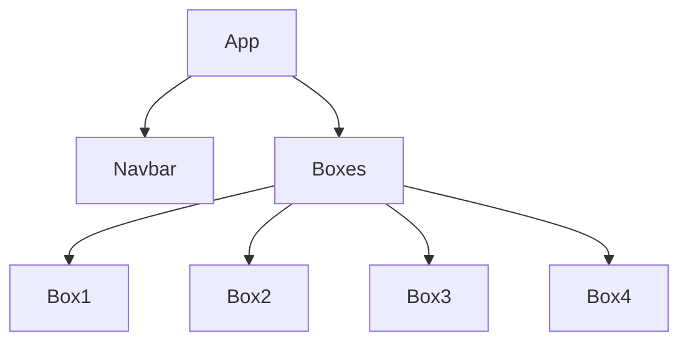
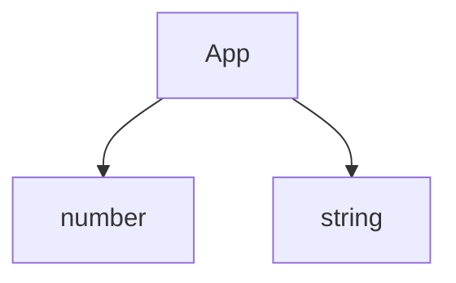

# 0、

React是干嘛的？

React是由Facebook（脸书）开源的一个进行创建用户界面的一款JavaScript库。

React 的核心思想是：封装组件。各个组件维护自己的状态和UI，当状态变更，自动重新渲染整个组件。

React 大体包含下面这些概念：

- 组件
- JSX
- Virtual DOM（React 会在内存中创建一个完全一样的虚拟的DOM树，每次DOM树中修改了某元素，React会先修改这个虚拟的DOM树，然后判读是否是和真实的DOM树不一样，不一样才会修改真实的DOM树）
- Data Flow

# 1、配置环境

[React官网地址](https://react.dev/)

1、Windows 下安装 Git Bash。[安装地址](https://gitforwindows.org/)

2、安装 Nodejs [安装地址](https://nodejs.org/en/)

3、安装 create-react-app 工具

+ 打开Git Bash，执行：

  ```bash
  npm i -g create-react-app
  ```

4、安装 VSCode 的插件

+ Simple React Snippets：自动化补全
+ Prettier - Code formatter：代码高亮

5、创建 React App

+ 在目标目录下打开Git Bash，在终端中执行：

  ```bash
  create-react-app react-app  # 可以替换为其他app名称，使用管理员打开终端运行
  
  cd react-app
  npm start  # 启动应用
  ```

+ 当前项目的目录：

  + node_modules：用来维护各种js库的
  + public/index.html：主页

6、JSX：React中的一种语言，会被 [Babel](https://babeljs.io/) 编译成标准JavaScript。就是在JS的基础上支持XML语言

# 2、Components

React中最核心的一部分就是组件。它是将 HTML、数据、函数 糅合在一起形成组件。

## 创建项目

新创建项目box-app：

```bash
create-react-app box-app
cd box-app
npm start
```

安装bootstrap库，在当前项目目录下打开终端：

```bash
npm i bootstrap
```

就会在 node_modules 中新建一个文件夹，就是 boostrap 。

bootstrap的引入方式：

```js
import 'bootstrap/dist/css/bootstrap.css';
```

可以将项目中无用的东西都删掉，比如 src 中的组件，只留下 index.js 和 index.css 即可，然后删除 index.js 中无用的部分：

```js
import React from 'react';
import ReactDOM from 'react-dom/client';
import './index.css';
import 'bootstrap/dist/css/bootstrap.css'

const root = ReactDOM.createRoot(document.getElementById('root'));
root.render(
  <React.StrictMode>
  </React.StrictMode>
);
```

## 创建Component

习惯在 src 目录下新建一个文件夹 components，用来方法所有的组件。然后在 components 文件夹下，创建组件（.jsx文件），比如新建一个 box.jsx 文件，盒子组件。

在 box.jsx 中，首先将 React 引进来：

```jsx
import React, { Component } from 'react';
```

+ 这一句代码可以直接敲 imrc 回车即可，因为装了一个自动补全的插件。

然后定义一个类组件：

```jsx
class Box extends Component {
    state = {  } 
    render() { 
        return ();
    }
}
 
export default Box;
```

+ 这一段代码也可以直接敲 cc 回车，就会有

定义完组件后，需要将组件在页面上渲染出来，需要在 index.js 中使用，（这个 index.js 就是整个js的入口）：

```jsx
import React from 'react';
import ReactDOM from 'react-dom/client';
import './index.css';
import 'bootstrap/dist/css/bootstrap.css'
import Box from './components/box';  // 引用进来

const root = ReactDOM.createRoot(document.getElementById('root'));
root.render(
  <React.StrictMode>
    <Box />  // 使用
  </React.StrictMode>
);
```


```jsx
import React, { Component } from 'react';

class Box extends Component {
    state = {  } 
    render() { 
        return <h1>Hello World</h1>;
    }
}
 
export default Box;
```

这段代码有两个东西

+ state：是一个局部变量，可以保存一些和当前组件有关的属性在里面，名字可以随意改
+ render：是一个 Component 类中的函数，用来返回当前组件用来渲染的 HTML 。

在这段代码中，没有用到 React 类，为什么要引入它？因为这是 jsx，翻译成 JavaScript 后会调用 React 类中的方法。

### 创建按钮

直接在 return 语句中添加两个按钮：

```jsx
class Box extends Component {
    state = {  } 
    render() { 
        return <h1>Hello World</h1>
        <button>left</button>
        <button>right</button>;
    }
}
```

但是此时会报错：

```bash
Parsing error: Adjacent JSX elements must be wrapped in an enclosing tag. Did you want a JSX fragment <>...</>?
```

这是因为 React 在返回元素的时候（React中的每一个元素都必须是一个标签），只能返回一个标签，不能返回多个标签，所以可以将这三个标签使用一个 `div` 标签括起来：

```jsx
class Box extends Component {
    state = {  } 
    render() { 
        return 
        <div><h1>Hello World</h1>
        <button>left</button>
        <button>right</button></div>; 
    }
}
```

这样就没有报错了，但是这样子在页面上什么也看不见，这是因为在 JS 中，每条语句都可以不加分号结尾，所以上面这个 return 语句其实相当于这样：

```jsx
return;
```

所以要把标签紧挨着 return 写：

```jsx
return <div><h1>Hello World</h1>
        <button>left</button>
        <button>right</button></div>; 
```

这样就能看到效果，或者说，我们一般会使用一个小括号括起来写：

```jsx
class Box extends Component {
    state = {  } 
    render() { 
        return (
            <div>
                <h1>Hello World</h1>
                <button>left</button>
                <button>right</button>
            </div>
            ); 
    }
}
```

这个时候页面也可以正常显示出这三个元素。但是我们多了一个没用的 `div` 标签，这个标签只是为了满足 React 的规则，没有什么意义，还会多出一个节点来，所以可以使用 `<React.Fragment>` 标签来代替 `div` 标签，这样满足返回一个元素的条件，也不会多出一个节点来：

```jsx
class Box extends Component {
    state = {  } 
    render() { 
        return (
                <React.Fragment><h1>Hello World</h1>
                <button>left</button>
                <button>right</button></React.Fragment>
            ); 
    }
}
```

`<React.Fragment>` 是一个虚拟元素，不会被渲染。

要点：当子节点数量大于1时，可以用`<div>`或`<React.Fragment>`将其括起来。

### 内嵌表达式

JSX中使用`{}`嵌入表达式。

如果想在 jsx 里面加一些 js 逻辑的话，需要使用 `{}` 括起来，`{}` 里只能写一句话。比如在 Box 类中定义一个变量 a = 10：

```jsx
class Box extends Component {
    state = {}
    a = 10;
    render() { 
        return (
                <React.Fragment><h1>Hello World</h1>
                <button>{this.a}</button>
                <button>right</button></React.Fragment>
            ); 
    }
}
```

页面上的按钮的内容就会显示出 10。

也可以使用函数：

```jsx
class Box extends Component {
    state = {}
    a = 10;
    render() { 
        return (
            <React.Fragment><h1>{ this.toString() }</h1>
                <button>{this.a}</button>
                <button>right</button></React.Fragment>
            ); 
    }
    toString() {
        return "Hello World"
    }
}
```

### 设置属性

在 HTML 中，给标签定义类的时候是使用的 class ，但是在 js 中，class 是一个关键字了，就不能使用 class 来指定标签的类了，要使用专门的 className 来代替：

```jsx
class Box extends Component {
    state = {}
    a = 10;
    render() { 
        return (
            <React.Fragment><h1>{ this.toString() }</h1>
                <button className='btn btn-primary'>{this.a}</button>
                <button className='btn btn-secondary'>right</button></React.Fragment>
            ); 
    }
    toString() {
        return "Hello World"
    }
}
```

如果想定义一个样式表的话，可以定义一个变量：

```jsx
class Box extends Component {
    state = {}
    a = 10;
    styles = {
        width: "50px",
        height: "50px",
        backgroundColor: "lightblue"
    }
    render() { 
        return (
            <React.Fragment><div style={this.styles}>{ this.toString() }</div>
                <button className='btn btn-primary m-2'>{this.a}</button>
                <button className='btn btn-secondary m-2'>right</button></React.Fragment>
            ); 
    }
    toString() {
        return "Hello World"
    }
}
```

也可以不创建变量：

```jsx
render() { 
    return (
        <React.Fragment><div style={{
                    width: "50px",
				    height: "50px",
					backgroundColor: "lightblue"
                }}>{ this.toString() }</div>
            <button className='btn btn-primary m-2'>{this.a}</button>
            <button className='btn btn-secondary m-2'>right</button></React.Fragment>
    ); 
}
```

要点

+ `class -> className`
+ CSS属性：`background-color -> backgroundColor`，其它属性类似，所有使用 `-` 隔开的名字全部改成驼峰命名法

### 数据驱动改变Style

可以让 style 和 state 相关，当组件某些值变化了的话，相关的样式也可以发生改变。

比如：

```jsx
class Box extends Component {
    state = {
        a : 10
    }
    render() { 
        return (
            <React.Fragment><div style={this.getStyles()}>{ this.toString() }</div>
                <button className='btn btn-primary m-2'>{this.a}</button>
                <button className='btn btn-secondary m-2'>right</button></React.Fragment>
            ); 
    }
    getStyles() {
        let styles = {
            width: "50px",
            height: "50px",
            backgroundColor: "lightblue"
        }
        if (this.state.a === 10)
            styles.backgroundColor = 'red'
        return styles
    }
    toString() {
        return "Hello World"
    }
}
```

当 state 中的 a 属性为 10 的时候，就将 `div` 的背景颜色改为红色。

执行顺序：在每一次页面渲染的时候，都会去 getStyle 函数中获取样式，当判断到 state 中的 a 为 10 之后，就会将 backgroundColor 改为 red。

### 渲染列表

定义一个 colors 数组，将这个数组渲染出来：

```jsx
state = {
    a: 10,
    colors: ['red', 'yellow', 'blue']
}
render() { 
    return (
        <React.Fragment>
            <div style={this.getStyles()}>{this.toString()}</div>
            <button className='btn btn-primary m-2'>{this.state.a}</button>
            <button className='btn btn-secondary m-2'>right</button>
            <div>{this.state.colors.map(c => (
                    <div>{ c }</div>
                )) }</div>
        </React.Fragment>
    ); 
}
```

`map()`函数是用于对数组中的每个元素执行指定的操作，并返回一个新的数组，新数组包含每个元素被操作后的结果。

此时浏览器的控制台会有警告：

```
Warning: Each child in a list should have a unique "key" prop.
```

所以如果使用以上数组遍历的方式的话，要给每个标签都加上一个唯一的 key 属性：

```jsx
<div>{this.state.colors.map(c => (
        <div key={c}>{ c }</div>
    )) }</div>
```

为什么非要加一个 key 属性呢？这其实是 React 的辅助功能，是为了提高效率。

要点

+ 使用map函数
+ 每个元素需要具有唯一的key属性，用来帮助React快速找到被修改的DOM元素。

### Conditional Rendering

利用逻辑表达式的短路原则。

+ 与表达式中 expr1 && expr2，当expr1为假时返回expr1的值，否则返回expr2的值
+ 或表达式中 expr1 || expr2，当expr1为真时返回expr1的值，否则返回expr2的值

比如，如果 colors 数组中没有元素的时候，就输出一句话，可以这样写：

```jsx
render() { 
    return (
        <React.Fragment>
            <div style={this.getStyles()}>{this.toString()}</div>
            <button className='btn btn-primary m-2'>{this.state.a}</button>
            <button className='btn btn-secondary m-2'>right</button>
            
            {this.state.colors.length === 0 && <p>No Colors!</p>}
            
            <div>{this.state.colors.map(c => (
                    <div key={c}>{ c }</div>
                )) }</div>
        </React.Fragment>
    ); 
}
```

+ 这是因为 `{}` 中不能写 if、else 等，所以可以另辟蹊径
+ 但是也可以使用函数代替，函数中随便写

### 绑定事件

给目前的两个按钮分别绑定一个点击事件：

```jsx
handleClickLeft() {
    console.log("left");
}
handleClickRight() {
    console.log("right");
}
render() { 
    return (
        <React.Fragment>
            <div style={this.getStyles()}>{this.toString()}</div>
            <button onClick={this.handleClickLeft} className='btn btn-primary m-2'>{this.state.a}</button>
            <button onClick={this.handleClickRight} className='btn btn-secondary m-2'>right</button>
        </React.Fragment>
    ); 
}
```

使用 onClick 来给按钮绑定点击事件，注意：这里是传一个函数过来，而不是调用函数，所以 this.handleClickLeft 后面不能写 `()` 。

此时可以输出 this 看看：

```jsx
handleClickLeft() {
    console.log("left", this);
}
handleClickRight() {
    console.log("right", this);
}
```

点击按钮后发现，输出的 this 的值是 undefined，这是因为不知道 React 是什么时候怎么调用了这个事件，所以 this 是 undefined。但是我们希望这个 this 的值是我们当前的 class 怎么办？最好写的办法就是使用箭头函数，因为箭头函数是不会绑定 this 的：

```jsx
handleClickLeft = () => {
    console.log("left", this);
}
handleClickRight = () => {
    console.log("right", this);
}
```

此时输出的 this 就是当前的类 Box。

或者也可以通过 `bind()` 函数：

```jsx
<button onClick={this.handleClickLeft.bind(this)} className='btn btn-primary m-2'>{this.state.a}</button>
<button onClick={this.handleClickRight.bind(this)} className='btn btn-secondary m-2'>right</button>
```

要点

+ 注意妥善处理好绑定事件函数的this

### 修改state

可以在上面的点击事件中来修改 state 中 a 属性的值：

```jsx
handleClickLeft = () => {
    this.state.a--;
    console.log(this.state.a);
}
handleClickRight = () => {
    this.state.a++;
    console.log(this.state.a);
}
render() { 
    return (
        <React.Fragment>
            <div style={this.getStyles()}>{this.state.a}</div>
            <button onClick={this.handleClickLeft} className='btn btn-primary m-2'>left</button>
            <button onClick={this.handleClickRight} className='btn btn-secondary m-2'>right</button>
        </React.Fragment>
    ); 
}
```

可以发现，this.state.a 的值会随着按钮的点击变化，但是页面上的 `div` 中显示出来的 this.state.a 却依旧没有变化，所以要调用一个 API 来告诉 React 这个值变化了，使用 setState 函数：

```jsx
handleClickLeft = () => {
    this.setState({
        a: this.state.a - 1
    }) 
}
handleClickRight = () => {
    this.setState({
        a: this.state.a + 1
    }) 
}
```

setState 函数中的参数是一个对象，属性名是 state 中对应的属性名，值是要修改的值。

可以实现点击按钮让 `div` 移动：通过外边距来实现

在获取样式的函数中，添加一个样式左外边距，左外边距的值是 this.state.a ，这样这个左边距就会随着按钮的点击而改变，因为 setState 函数会重新调用 render 函数

```jsx
getStyles() {
    let styles = {
        width: "50px",
        height: "50px",
        backgroundColor: "lightblue",
        marginLeft: this.state.a
    }
    if (this.state.a === 10)
        styles.backgroundColor = 'red'
    return styles
}
```

要点

+ 需要使用`this.setState(`)函数
+ 每次调用`this.setState()`函数后，会重新调用`this.render()`函数，用来修改虚拟DOM树。React只会修改不同步的实际DOM树节点。

### 给事件函数添加参数

可以定义一个临时函数，或者说辅助函数，在这个临时函数中再调用目标函数，并且传一个参数过去：

```jsx
handleClickLeft = () => {
    this.setState({
        a: this.state.a - 1
    }) 
}
handleClickRight = (step) => {
    this.setState({
        a: this.state.a + step
    }) 
}
handleClickRightTemp = () => {
    this.handleClickRight(10);
}
render() { 
    return (
        <React.Fragment>
            <div style={this.getStyles()}>{this.state.a}</div>
            <button onClick={this.handleClickLeft} className='btn btn-primary m-2'>left</button>
            <button onClick={this.handleClickRightTemp} className='btn btn-secondary m-2'>right</button>
        </React.Fragment>
    ); 
}
```

这样每次点击右边的按钮都会将左外边距加 10。

也可以直接将这个临时函数定义为一个匿名函数：

```jsx
<button onClick={() => this.handleClickRight(10)} className='btn btn-secondary m-2'>right</button>
```

# 2.5、举个例子

实现一个简易版的表格。

先新建一个项目，然后安装 bootstrap

```bash
create-react-app solution-app

cd solution-app
npm i bootstrap
```

修改默认生成的文件，在 src 下新建一个目录 components，在 components 下新建一个组件 Solution.jsx：

```jsx
import React, { Component } from 'react';

class Solution extends Component {
    state = {  } 
    render() { 
        return <h1>Hello World</h1>;
    }
}
 
export default Solution;
```

然后在 index.js 中引入并使用这个组件，并引入 bootstrap，使用 bootstrap 的 container 类样式，container 可以自适应的改变页面的区域大小，我们可以将所有内容放在 container 中：

```jsx
//....
import 'bootstrap/dist/css/bootstrap.css'
import Solution from './components/Solution';

const root = ReactDOM.createRoot(document.getElementById('root'));
root.render(
  <React.StrictMode>
    <div className="container">
      <Solution />
    </div>
  </React.StrictMode>
);
```

我们先准备要实现列表的数据，写在 state 中：

```jsx
state = { 
    solutions: [
        {number: 123, title: "打家劫舍1", views: 1032},
        {number: 124, title: "打家劫舍2", views: 1340},
        {number: 125, title: "打家劫舍3", views: 1342},
        {number: 126, title: "打家劫舍4", views: 1030},
        {number: 127, title: "打家劫舍5", views: 1040},
        {number: 128, title: "打家劫舍6", views: 1005},
        {number: 129, title: "打家劫舍7", views: 1006},
        {number: 130, title: "打家劫舍8", views: 1007},
        {number: 131, title: "打家劫舍9", views: 1000},
    ]
} 
```

然后去 bootstrap 中找一个好看的 table 样式用上：

```jsx
render() { 
    return (
        <table className="table table-hover">
            <thead>
                <tr>
                    <th>#</th>
                    <th>标题</th>
                    <th>阅读</th>
                    <th>操作</th>
                </tr>
            </thead>
            <tbody>
                {this.state.solutions.map(s => (
                    <tr key={s.number}>
                        <td>{s.number }</td>
                        <td>{s.title}</td>
                        <td>{s.views}</td>
                        <td><button className='btn btn-warning'>删除</button></td>
                    </tr>
                ))}
            </tbody>
        </table>
    );
}
```

+ 注意使用 map 函数时需要指定每个元素的 key ，否则会有警告。

此时的页面效果：


然后要给删除按钮绑定删除的事件：

```jsx
button onClick={() => this.handleClickDelete(s)} className='btn btn-warning'>删除</button>
```

+ 删除需要将当前要删除的元素传过去

然后实现删除函数：

```jsx
handleClickDelete(s) {
    this.setState({
        solutions : this.state.solutions.filter(x => s.number != x.number)
    })
}
```

+ filter 函数会将数组中每一个元素都筛选一遍，filter 中传一个函数，这个函数有一个返回值，如果返回 true，则将数组中这个元素留下，否则删除。

也可以这样写：

```jsx
handleClickDelete(s) {
    const solutions = this.state.solutions.filter(x => s.number != x.number);
    this.setState({
        solutions
    })
}
```

+ 当 setState 函数中的属性名和一个变量的名字相等时，也可以不用手动赋值

设置当删除了所有的列表后，不显示 table，在 render 函数忠这样写：

```jsx
if (this.state.solutions.length === 0)
    return <p>没有题解啦！</p>
```

如果想自己设置样式的话，在 src 下的 index.css 中设置。

也可以将删除按钮的功能改为一个新加功能：

```jsx
 handleClickDelete(s) {
     // const solutions = this.state.solutions.filter(x => s.number != x.number);
     let solutions = [...this.state.solutions, {
         number: 132, title: "打家劫舍10", views: 1200,
     }]
     this.setState({
         solutions
     })
 }
```


# 3、组合Components

## 创建Boxes组件

Boxes组件中包含一系列Box组件。

使用之前写的 box-app。再在 src/components 下新建一个组件 boxes.jsx：

```jsx
import React, { Component } from 'react';

class Boxes extends Component {
    state = {  } 
    render() { 
        return (<h1>Boxes</h1>);
    }
}
 
export default Boxes;
```

然后在 index.js 中使用：

```js
import React from 'react';
import ReactDOM from 'react-dom/client';
import './index.css';
import 'bootstrap/dist/css/bootstrap.css'
import Box from './components/box';
import Boxes from './components/boxes';

const root = ReactDOM.createRoot(document.getElementById('root'));
root.render(<Boxes />);
```

然后在 boxes 中使用 box 组件：

```jsx
import React, { Component } from 'react';
import Box from './box';

class Boxes extends Component {
    state = {  } 
    render() { 
        return (
            <React.Fragment>
                <Box />
                <Box />
                <Box />
                <Box />
            </React.Fragment>
        );
    }
}
 
export default Boxes;
```

此时页面上就有四个独立的 box 组件：


也可以使用数组来写，box 组件中只有一个属性就是 a，可以在 state 中创建一个数组来保存所有的 a，然后使用 map 函数将每个 a 转为 Box 组件：

```jsx
class Boxes extends Component {
    state = { 
        boxes: [
            {id:1, a:0},
            {id:2, a:0},
            {id:3, a:0},
            {id:4, a:0},
        ]
     } 
    render() { 
        return (
            <React.Fragment>
                {this.state.boxes.map(box => <Box key={box.id} />)}
            </React.Fragment>
        );
    }
}
```

## 从上往下传递数据

通过`this.props`属性可以从上到下传递数据。

`this.props` 中存储的就是这个组件在定义时，里面的所有属性。

比如，在 boxes.js 中，返回标签的时候，在 Box 标签上定义一些属性：

```jsx
render() { 
    return (
        <React.Fragment>
            {this.state.boxes.map(box => <Box key={box.id} a={box.a} name="zsm" age="18" sex/>)}
        </React.Fragment>
    );
}
```

然后在 box.jsx 中渲染的时候可以输出一下 `this.props` 的值：

```js
console.log(this.props)
```

可以看到结果：


结果就是我们定义标签时添加的属性，其中如果属性没有赋值的话，会默认是 true，这就和 HTML 中的属性类似。

当然，这个传值什么都可以传，函数或者对象都可以。

然后可以使用 `this.props` 将值更新到 state 中，在 box.jsx 中：

```jsx
state = {
    a: this.props.a
}
```

## 传递子节点

通过t`his.props.children`属性传递子节点

可以发现，在使用 Box 组件的时候，标签可以这样写：

```jsx
<Box />
```

但是也可以这样写：

```jsx
<Box></Box>
```

在这种双标签的模式下，可以在里面放一些子节点：

```jsx
<Box>
	<h1>Title</h1>
    <p>Content</p>
</Box>
```

比如，在 boxes.jsx 中返回标签的时候这样写：

```jsx
render() { 
    return (
        <React.Fragment>
            {this.state.boxes.map(box => (
                <Box key={box.id}>
                    <h1>Title</h1>
                    <p>Content</p>
                </Box>
            ))}
        </React.Fragment>
    );
}
```

这时候再看输出的 `this.props` 中的值：


发现 Box 中的两个子节点是以 children 属性存在 `this.props` 中的。这些子节点也是可以直接使用的，在 box.jsx 中：

```jsx
render() { 
    console.log(this.props)
    return (
        <React.Fragment>
            {this.props.children}
            <div style={this.getStyles()}>{this.state.a}</div>
            <button onClick={() => this.handleClickLeft(10)} className='btn btn-primary m-2'>left</button>
            <button onClick={() => this.handleClickRight(10)} className='btn btn-secondary m-2'>right</button>
        </React.Fragment>
    ); 
}
```

这样的效果：


## 从下往上调用函数

父元素可以通过 `this.props` 来给子元素传递数据，子元素也可以调用父元素的函数。

比如，可以在每个 box 中添加一个删除按钮，点击这个按钮后这个 box 组件就被删除。因为此时 box 组件是被保存在 boxes 组件的 state 中的，所以此时需要调用从子元素 box 中调用父元素 boxes 中的函数，这个可以通过 `this.props` 来实现。

先在 boxes 中添加一个删除的函数，然后通过属性传递给 box 子元素：

```jsx
handleDelete = () => {  // 定义删除的元素
    console.log("delete");
}
render() { 
    return (
        <React.Fragment>
            {this.state.boxes.map(box => (
                <Box key={box.id} onDelete={this.handleDelete}>  // 通过属性传递
                    <h1>Title</h1>
                    <p>Content</p>
                </Box>
            ))}
        </React.Fragment>
    );
}
```

然后在 box 中新加一个按钮，并绑定点击事件，通过 `this.props` 调用：

```jsx
render() { 
    console.log(this.props)
    return (
        <React.Fragment>
            //...
            <button className='btn btn-danger m-2' onClick={this.props.onDelete}>Delete</button>
        </React.Fragment>
    ); 
}
```

此时已经可以从子元素调用到父元素中的函数了，只需要修改父元素函数的实现即可：

```jsx
handleDelete = (box) => {
    const boxes = this.state.boxes.filter(x => x != box)
    this.setState({
        boxes
    })
}
render() { 
    return (
        <React.Fragment>
            {this.state.boxes.map(box => (
                <Box key={box.id} onDelete={() => this.handleDelete(box)}>
                    <h1>Title</h1>
                    <p>Content</p>
                </Box>
            ))}
        </React.Fragment>
    );
}
```

注意：每个组件的`this.state`只能在组件内部修改，不能在其他组件内修改。如果想要父组件和子组件的 state 值保持一致的话，可以删除掉子组件的 state，只用父组件通过属性传过来的值，这样当父组件的 state 修改了后，子组件的值也会同步发生变化。

比如：box.jsx

```jsx
import React, { Component } from 'react';

class Box extends Component {
    
    render() { 
        return (
            <React.Fragment>
                <div style={this.getStyles()}>{this.props.box.x}</div>
                <button 
                    onClick={() => this.props.onClickLeft(this.props.box)} 
                    className='btn btn-primary m-2'>left</button>
                <button 
                    onClick={() => this.props.onClickRight(this.props.box)} 
                    className='btn btn-secondary m-2'>right</button>
                <button 
                    className='btn btn-danger m-2' 
                    onClick={() => this.props.onDelete(this.props.box)}>Delete</button>
            </React.Fragment>
            ); 
    }
    getStyles() {
        let styles = {
            width: "50px",
            height: "50px",
            backgroundColor: "lightblue",
            marginLeft: this.props.box.x,
            textAlign: "center",
            lineHeight: "50px"
        }
        if (this.props.box.x === 10)
            styles.backgroundColor = 'red'
        return styles
    }
    toString() {
        return "Hello World"
    }
}
 
export default Box;
```

+ 删除了自己的 state，所有数据都来自 `this.props` 

boxes.jsx

```jsx
import React, { Component } from 'react';
import Box from './box';

class Boxes extends Component {
    state = { 
        boxes: [
            {id:1, x:1},
            {id:2, x:2},
            {id:3, x:3},
            {id:4, x:4},
        ]
    } 
    handleDelete = (box) => {
        const boxes = this.state.boxes.filter(x => x != box)
        this.setState({
            boxes
        })
    }
    handleClickLeft = (box) => {
        const boxes = [...this.state.boxes];
        const k = boxes.indexOf(box);
        boxes[k].x -= 10;
        this.setState({boxes})
    }
    handleClickRight = (box) => {
        const boxes = [...this.state.boxes];
        const k = boxes.indexOf(box);
        boxes[k].x += 10;
        this.setState({boxes})
    }
    handleClickReset = () => {
        const boxes = this.state.boxes.map(b => { return { id: b.id, x: 0 } })
        this.setState({boxes})
    }
    render() { 
        return (
            <React.Fragment>
                <button 
                    style={{marginBottom:"10px"}}
                    onClick={this.handleClickReset} 
                    className='btn btn-info'>Reset</button>
                {this.state.boxes.map(box => (
                    <Box
                        key={box.id}
                        onDelete={this.handleDelete}
                        box={box}
                        onClickLeft={this.handleClickLeft}
                        onClickRight={this.handleClickRight}>
                    </Box>
                ))}
            </React.Fragment>
        );
    }
}
 
export default Boxes;
```

+ 将子组件需要的函数、对象都通过属性的方式传下去

以上这种写法可以同步修改两个组件。

## 每个维护的数据仅能保存在一个this.state中

+ 不要直接修改this.state的值，因为setState函数可能会将修改覆盖掉。

## 创建App组件

包含：

+ 导航栏组件
+ Boxes组件

先在 src/components 下新建一个 app.jsx 组件：

```jsx
import React, { Component } from 'react';

class App extends Component {
    state = {  } 
    render() { 
        return (<h1>Hello App</h1>);
    }
}
 
export default App;
```

然后在 index.js 中使用它

```js
import React from 'react';
import ReactDOM from 'react-dom/client';
import './index.css';
import 'bootstrap/dist/css/bootstrap.css';
import App from './components/app';

const root = ReactDOM.createRoot(document.getElementById('root'));
root.render(<App />);
```

然后定义一个导航栏组件 navbar.jsx 

```jsx
import React, { Component } from 'react';

class Navbar extends Component {
    state = {  } 
    render() { 
        return (
            <nav className="navbar bg-body-tertiary">
                <div className="container-fluid">
                    <a className="navbar-brand" href="#">Navbar</a>
                </div>
            </nav>
        );
    }
}
 
export default Navbar;
```

然后将这个 Navbar 组件和 Boxes 组件都用在 App 组件中：

```jsx
import React, { Component } from 'react';
import Navbar from './navbar';
import Boxes from './boxes';

class App extends Component {
    state = {  } 
    render() { 
        return (
            <React.Fragment>
                <div className="container">
                    <Navbar />
                    <Boxes />
                </div>
            </React.Fragment>
        );
    }
}
 
export default App;
```

+ 将 Navbar 和 Boxes 都放在 container 中，好看点

此时效果：


此时的结构：



先在我们想在 Navbar 中存储一些 Boxes 中的信息，也就是将 Boxes 中的信息传递到 Navbar 中，这就是兄弟间传递信息。比如 Navbar 中要显示 Boxes 中有多少个 Box。

需要通过最近的公共祖先。

所以要将 Boxes 中所有和 state 相关的内容都放在 App 中去：

```jsx
import React, { Component } from 'react';
import Navbar from './navbar';
import Boxes from './boxes';

class App extends Component {
    state = { 
        boxes: [
            {id:1, x:1},
            {id:2, x:2},
            {id:3, x:3},
            {id:4, x:4},
        ]
    } 
    handleDelete = (box) => {
        const boxes = this.state.boxes.filter(x => x != box)
        this.setState({
            boxes
        })
    }
    handleClickLeft = (box) => {
        const boxes = [...this.state.boxes];
        const k = boxes.indexOf(box);
        boxes[k].x -= 10;
        this.setState({boxes})
    }
    handleClickRight = (box) => {
        const boxes = [...this.state.boxes];
        const k = boxes.indexOf(box);
        boxes[k].x += 10;
        this.setState({boxes})
    }
    handleClickReset = () => {
        const boxes = this.state.boxes.map(b => { return { id: b.id, x: 0 } })
        this.setState({boxes})
    }
    render() { 
        return (
            <React.Fragment>
                <div className="container">
                    <Navbar />
                    <Boxes
                        boxes={this.state.boxes}
                        onReset={this.handleClickReset}
                        onClickLeft={this.handleClickLeft}
                        onClickRight={this.handleClickRight}
                        onDelete={this.handleDelete}
                    />
                </div>
            </React.Fragment>
        );
    }
}
 
export default App;
```

然后修改 Boxes 中用到的 state 的地方：

```jsx
import React, { Component } from 'react';
import Box from './box';

class Boxes extends Component { 
    render() { 
        return (
            <React.Fragment>
                <button 
                    style={{marginBottom:"10px"}} 
                    onClick={this.props.onReset} 
                    className='btn btn-info'>Reset</button>
                {this.props.boxes.map(box => (
                    <Box
                        key={box.id}
                        onDelete={this.props.onDelete}
                        box={box}
                        onClickLeft={this.props.onClickLeft}
                        onClickRight={this.props.onClickRight}>
                    </Box>
                ))}
            </React.Fragment>
        );
    }
}
 
export default Boxes;
```

接下来就是从 App 中传递数据到 Navbar 中：

```jsx
<Navbar boxesCount={this.state.boxes.length} />
```

再在 Navbar 中使用：

```jsx
<nav className="navbar bg-body-tertiary">
    <div className="container-fluid">
        <a className="navbar-brand" href="/">Navbar Boxes Count:{this.props.boxesCount}</a>
    </div>
</nav>
```

此时效果：


注意：

+ 要将多个组件共用的数据存放到最近公共祖先的`this.state`中。

## 无状态函数组件

函数组件相当于只有 render 函数的类组件。

无状态的函数组件创建的快捷方式是输入 sfc (stateless functional component)回车：

```jsx
const = () => {
    return (  );
}
```

就比如上面的 Navbar 组件，没有用上 state 这个属性，所以可以改为函数组件：

```jsx
import React, { Component } from 'react';

const Navbar = (props) => {
    return (
        <nav className="navbar bg-body-tertiary">
            <div className="container-fluid">
                <a className="navbar-brand" href="/">Navbar Boxes Count:{props.boxesCount}</a>
            </div>
        </nav>
    );
}
 
export default Navbar;
```

+ 注意：类组件是通过 `this.props` 来传递信息的，在函数组件中，这个 props 是传在参数里面的

也可以将 Boxes 组件变为函数组件：

```jsx
import React, { Component } from 'react';
import Box from './box';

const Boxes = (props) => {
    return (
        <React.Fragment>
            <button 
                style={{marginBottom:"10px"}} 
                onClick={props.onReset} 
                className='btn btn-info'>Reset</button>
            {props.boxes.map(box => (
                <Box
                    key={box.id}
                    onDelete={props.onDelete}
                    box={box}
                    onClickLeft={props.onClickLeft}
                    onClickRight={props.onClickRight}>
                </Box>
            ))}
        </React.Fragment>
    );
}
 
export default Boxes;
```

+ 还可以在参数上使用解构的语法：

  ```jsx
  const Boxes = ({boxes,onReset,onDelete,onClickLeft,onClickRight}) => {
      return (
          <React.Fragment>
              <button style={{marginBottom:"10px"}} onClick={onReset} className='btn btn-info'>Reset</button>
              {boxes.map(box => (
                  <Box
                      key={box.id}
                      onDelete={onDelete}
                      box={box}
                      onClickLeft={onClickLeft}
                      onClickRight={onClickRight}>
                  </Box>
              ))}
          </React.Fragment>
      );
  }
  ```

要点

+ 当组件中没有用到`this.state`时，可以简写为无状态的函数组件。
+ 函数的传入参数为props对象

## 组件的生命周期

+ `Mount`周期，执行顺序：`constructor() -> render() -> componentDidMount()`
+ `Update`周期，执行顺序：`render() -> componentDidUpdate()`
+ `Unmount`周期，执行顺序：`componentWillUnmount()`

### Mount 周期：被创建出来后

```jsx
constructor() {
    super();
    console.log("App - Constructor")
}
```

+ App 类继承自其他类，所以构造函数中必须先调用父类的构造函数

```jsx
render() { 
    console.log("App - Render")
    //。。。
}
```

```jsx
componentDidMount() {
    console.log("App - ComponentDidMount")
}
```

可以看到执行顺序：


可以给所有的组件都添加上这三个函数，看一下执行顺序：


### Update 周期：每次修改

在 Box 组件中添加一个函数：

```jsx
componentDidUpdate() {
    console.log("Box - componentDidUpdate");
}
```

然后删除所有组件中的 constructor 和 componentDidMount 函数，这样方便看控制台的输出，然后点击页面上的一个 right 按钮，查看输出：


可以看到，点击按钮后，会先执行 render 函数，然后执行 componentDidUpdate 函数，并且所有的 Box 组件都会刷新，但是实际上的DOM树中只会刷新我们点击的那个组件：


可以看到，实际的 DOM 树只刷新了这一个 `div` 标签。

在 componentDidUpdate 函数中，有两个参数：

```jsx
componentDidUpdate(prevProps, prevState) {

}
```

+ prevProps：表示上一次的属性
+ prevState：表示上一次的state

### Unmount 周期：删除的时候

和上面函数的用法类似，会在删除之前执行。

# 4、路由

怎么将页面和url对应起来

## Web分类

页面可以看成是模板 + 数据。

+ 静态页面：页面里的数据是写死的
+ 动态页面：页面里的数据是动态填充的
  + 后端渲染：数据在后端填充
  + 前端渲染：数据在前端填充

## 安装环境

创建一个新的项目，route-app。

+ VSCODE安装插件：`Auto Import - ES6, TS, JSX, TSX`，更加智能的引入
+ 安装`Route`组件：`npm i react-router-dom`
+ 安装 bootstrap：`npm i bootstrap`

然后删除掉没用的代码和组件，创建一个 components 文件夹存放组件，再创建一个根组件 app.jsx。

在 index.js 中引入 bootstrap 的样式：

```js
import 'bootstrap/dist/css/bootstrap.css';
```

## Route组件介绍

+ `BrowserRouter`：所有需要路由的组件，都要包裹在`BrowserRouter`组件内
+ `Link`：跳转到某个链接，`to`属性表示跳转到的链接
+ `Routes`：类似于C++中的`switch`，匹配第一个路径
+ `Route`：路由，`path`属性表示路径，`element`属性表示路由到的内容

如果想通过 route 来路由前端页面的话，那么一定要将组件包含在 BrowserRouter 组件内。所以在 index.js 中先引入 BrowserRouter，然后包含 App 组件：

```jsx
import React from 'react';
import ReactDOM from 'react-dom/client';
import './index.css';
import App from './components/app';
import { BrowserRouter } from 'react-router-dom';

const root = ReactDOM.createRoot(document.getElementById('root'));
root.render(
  <BrowserRouter>
    <App />
  </BrowserRouter>
);
```

### 实现页面

先实现导航栏组件：

```jsx
import React, { Component } from 'react';

class Navbar extends Component {
    state = {  } 
    render() { 
        return (
            <nav className="navbar navbar-expand-lg bg-body-tertiary">
                <div className="container-fluid">
                    <a className="navbar-brand" href="#">讲义</a>
                    <button className="navbar-toggler" type="button" data-bs-toggle="collapse" data-bs-target="#navbarNav" aria-controls="navbarNav" aria-expanded="false" aria-label="Toggle navigation">
                    <span className="navbar-toggler-icon"></span>
                    </button>
                    <div className="collapse navbar-collapse" id="navbarNav">
                    <ul className="navbar-nav">
                        <li className="nav-item">
                        <a className="nav-link active" aria-current="page" href="/">Home</a>
                        </li>
                        <li className="nav-item">
                        <a className="nav-link" href="/MySql">MySql</a>
                        </li>
                        <li className="nav-item">
                        <a className="nav-link" href="/Java">Java</a>
                        </li>
                        <li className="nav-item">
                        <a className="nav-link" href='/HTML'>HTML</a>
                        </li>
                    </ul>
                    </div>
                </div>
            </nav>
        );
    }
}
 
export default Navbar;
```

然后在 App 组件中使用：

```jsx
import React, { Component } from 'react';
import Navbar from './navbar';

class App extends Component {
    state = {  } 
    render() { 
        return (
            <React.Fragment>
                <Navbar/>
            </React.Fragment>
        );
    }
}
 
export default App;
```

当前页面：


然后创建四个组件，分别对应导航栏上四个链接。再建一个组件，用来显示找不到页面时的 404 页面

+ home.jsx
+ mysql.jsx
+ java.jsx
+ html.jsx
+ notFount.jsx

```jsx
import React, { Component } from 'react';

class Home extends Component {
    state = {  } 
    render() { 
        return <h1>Home</h1>;
    }
}
 
export default Home;
```

这些组件，要有选择性的放到根组件下，所以先引入到根组件中：

```jsx
import Home from './home';
import Java from './java';
import Html from './html';
import NotFount from './notFount';
import Mysql from './mysql';
```

然后要根据 url 显示对应的页面

### Routes 和 Route

首先要将所有的路由都放在 `<Routes></Routes>` 标签中，那也要先引入 Routes 和 Route 标签：

```jsx
import { Routes, Route } from 'react-router-dom';
```

每一个 Routes 中可以有很多个 Route，要让每一个路径都对应上一个组件：

```jsx
class App extends Component {
    state = {  } 
    render() { 
        return (
            <React.Fragment>
                <Navbar />
                <Routes>
                    <Route path='/' element={ <Home /> } />
                    <Route path='/Java' element={ <Java /> } />
                    <Route path='/MySql' element={ <Mysql /> } />
                    <Route path='/HTML' element={ <Html /> } />
                </Routes>
            </React.Fragment>
        );
    }
}
```

+ path：表示路径
+ element：表示组件，但是也不一定非要写一个组件，也可以写 JSX 代码

此时，点击导航栏上的链接，就会显示对应的组件：


此时，可以观察开发者工具中的 network，发现每次点击链接都会刷新一遍，说明每次点击都是重新加载一次页面，那如何实现不重新加载页面呢？

### Link

使用 `Link` 组件，让你假装跳到另一个页面，其实并没有像后端发送请求。

在 Navbar 中引入 Link 组件，并把所有的 a 标签改为 Link：

```jsx
import React, { Component } from 'react';
import { Link } from 'react-router-dom';

class Navbar extends Component {
    state = {  } 
    render() { 
        return (
            <nav className="navbar navbar-expand-lg bg-body-tertiary">
                <div className="container-fluid">
                    <Link className="navbar-brand" to="#">讲义</Link>
                    <button className="navbar-toggler" type="button" data-bs-toggle="collapse" data-bs-target="#navbarNav" aria-controls="navbarNav" aria-expanded="false" aria-label="Toggle navigation">
                    <span className="navbar-toggler-icon"></span>
                    </button>
                    <div className="collapse navbar-collapse" id="navbarNav">
                    <ul className="navbar-nav">
                        <li className="nav-item">
                        <Link className="nav-link active" to="/">Home</Link>
                        </li>
                        <li className="nav-item">
                        <Link className="nav-link" to="/MySql">MySql</Link>
                        </li>
                        <li className="nav-item">
                        <Link className="nav-link" to="/Java">Java</Link>
                        </li>
                        <li className="nav-item">
                        <Link className="nav-link" to='/HTML'>HTML</Link>
                        </li>
                    </ul>
                    </div>
                </div>
            </nav>
        );
    }
}
 
export default Navbar;
```

这时再点击链接就不会重新刷新页面，只是跳转。其实是替换了显示的组件。

## URL中传递参数

要在 Java 页面中渲染讲义列表：

```jsx
import React, { Component } from 'react';

class Java extends Component {
    state = { 
        javas: [
            {id: 1, title:"基础"},
            {id: 2, title:"中级"},
            {id: 3, title:"高级"},
        ]
     } 
    render() { 
        return (
            <React.Fragment>
                <h1>Java</h1>
                <hr />
                {this.state.javas.map(j => (
                    <div>{j.id}、{j.title}</div>  
                ))}
            </React.Fragment>
        );
    }
}
 
export default Java;
```

给每个选项添加链接：

```jsx
render() { 
    return (
        <React.Fragment>
            <h1>Java</h1>
            <hr />
            {this.state.javas.map(j => (
                <Link to={'/Java/content/' + j.id}>
                    <div>{j.id}、{j.title}</div>  
                </Link>
            ))}
        </React.Fragment>
    );
}
```

记得要先引入 Link ，然后先在就是这样的页面：


比如，点击第一个链接后，地址栏会变成：http://localhost:3000/Java/content1。那么假如我们有很多个讲义的话，就需要给每个讲义也页面配置一个路径，我们就可以通过这种在后面加上 id 的方式实现。

那么如何根据链接后面的 id 去渲染对应的讲义？

```jsx
<Route path='/Java/content/:chapter' element={ <JavaContent /> } />
```

这种写法，就会将 content/ 后面的内容保存到 chapter 这个变量中。

新建一个组件 JavaContent：

```jsx
import React, { Component } from 'react';

class JavaContent extends Component {
    state = {  } 
    render() { 
        return (
            <h1>Java - 1</h1>
        );
    }
}
 
export default JavaContent;
```

获取 URL 的参数：

```jsx
import React, { Component } from 'react';
import { useParams } from 'react-router-dom';

class JavaContent extends Component {
    state = {  } 
    render() { 
        console.log(this.props.params)
        return (
            <h1>Java - {this.props.params.chapter}</h1>
        );
    }
}
 
export default (props) => (
    <JavaContent
        {...props}
        params={useParams()}
    />
);
```

如果 URL 有多个参数：

```jsx
<Route path='/Java/content/:chapter/:section' element={ <JavaContent /> } />
```

然后想获取 URL 的参数的话：

```jsx
{this.props.params.section}
```

http://localhost:3000/Java/content?chapter=1&section=2这种的参数怎么获取？

使用 useSearchParams。

## Search Params传递参数

在路由匹配的时候，只需要匹配到问号前面部分，

```jsx
<Route path='/Java/content' element={ <JavaContent /> } />
```

先引入：

```jsx
import { useSearchParams } from 'react-router-dom';
```

这个 SearchParams 是一个数组，里面有两个值，第一个是获取参数，第二个是设置参数

```+ jsx
import React, { Component } from 'react';
import { useSearchParams } from 'react-router-dom';

class JavaContent extends Component {
    state = {  
        searchParams: this.props.params[0],  // 获取某个参数
        setSearchParams: this.props.params[1]  // 设置链接中的参数，然后重新渲染当前页面
    } 
    render() { 
        console.log(this.state.searchParams.get('chapter'))
        console.log(this.state.searchParams.get('section'))
        return (
            <h1>Java - {this.state.searchParams.get('chapter')}</h1>
        );
    }
}
 
export default (props) => (
    <JavaContent
        {...props}
        params={useSearchParams()}
    />
);
```

+ 当没有 chapter 这个参数时， `this.state.searchParams.get('chapter')` 返回 null

函数组件写法：

```jsx
import React, { Component } from 'react';
import { useSearchParams } from 'react-router-dom';

const Django = () => {
    let [searchParams, setSearchParams] = useSearchParams();
    console.log(searchParams.get('age'));
    return (<h1>Django</h1>);
}

export default Django;
```

## 重定向

当打开一个不存在的页面时，应该重定向到 404 页面。

先定义 404 页面的路由：

```+ jsx
<Route path='/404' element={ <NotFount /> } />
```

在路由里面可以使用通配符，在路由的最下面写一个路由：

```jsx
<Routes>
    <Route path='/' element={ <Home /> } />
    <Route path='/Java' element={ <Java /> } />
    <Route path='/MySql' element={ <Mysql /> } />
    <Route path='/HTML' element={<Html />} />
    <Route path='/Java/content' element={ <JavaContent /> } />
    <Route path='/404' element={<NotFount />} />
    <Route path='*' element={ <NotFount /> } />
</Routes>
```

因为 Routes 是从上往下挨个匹配的，当匹配到最后一个时就说明前面的路由都不满足，最后一个使用了通配符，表示可以匹配所有链接。

使用Navigate组件可以重定向。

```jsx
<Route path="*" element={ <Navigate replace to="/404" /> } />
```

+ to 表示要跳转到哪个链接

+ 这种写法也适用于给其他组件传递参数：

  ```jsx
  <Route path='/Java/content' element={ <JavaContent id="hhh"/> } />
  ```

## 嵌套路由

假设MySql页面有两个模块，一个是作业，通过  /MySql/homework 访问，一个是笔记，通过 /MySql/note 访问，这时就可以使用嵌套路由：

```jsx
<Route path='/MySql' element={<Mysql />} >
    <Route path='homework' element={<h1>作业</h1>}></Route>
    <Route path='note' element={<h1>笔记</h1>}></Route>
</Route>
```

+ 子 Route 中的 path 只需要写父 Route 的 path 后的路径，不要再加 /

但此时访问 http://localhost:3000/MySql/homework 并没有渲染出 作业。这时我们需要使用 Outlet 组件来填充子路由的内容：

```jsx
import { Outlet } from 'react-router-dom';

class Mysql extends Component {
    state = {  } 
    render() { 
        return (
            <React.Fragment>
                <h1>MySql</h1>
                <hr />
                <Outlet />
            </React.Fragment>
        );
    }
}
```

注意：需要在父组件中添加<Outlet />组件，用来填充子组件的内容。

# 5、Redux

redux将所有数据存储到树中，且树是唯一的。

在之前，想在兄弟节点间传递数据的话，是通过他们的最近公共祖先来实现的，将所有的数据都保存在这个公共祖先中，如果我们的DOM树很复杂的话，节点很多的话，这种方法就很麻烦。

Redux 就是在 DOM 树之外，拿出一块地方，用来存储一些全局的值。也就是说，可以将不同组件间需要交互的数据单独拿出来，放在一个全局的模块里，这样当两个组件需要交互数据时就不需要去找公共祖先。

Redux 在存数据的时候，会将每个数据都维护成一个树的结构，使用字典来存的。

## Redux基本概念

+ store：存储树结构。
+ state：维护的数据，一般维护成树的结构。
+ reducer：对state（每个节点的值）进行更新的函数，每个state绑定一个reducer。传入两个参数：当前state和action，返回新state。想修改某一个节点的值的话，会将整个树都更新一遍
+ action：一个普通对象，存储reducer的传入参数，一般描述对state的更新类型。
+ dispatch：传入一个参数action，对整棵state树操作一遍。action 是个字典，一般有个属性 type，每个节点都有自己对应的 type，如果节点 type 值和 action 的 type 值相当了，就更新当前节点

创建一个 redux-app。

安装 Redux：

```bash
npm i redux react-redux @reduxjs/toolkit
```

### 维护一个节点

在 index.js 中先试着维护一个数据：

```js
const f1 = (state = 0, action) => {
  switch (action.type) {
    case "add": return state + 1;
    case "sub": return state - 1;
    default: return state;
  }
}
```

+ 第一个参数 state 是表示上一次的 state，第一次调用的时候传过来的应该是 undefined，所以给个初始值 0

然后使用 configureStore 将这个 f1 函数变为一个树：

```js
import { configureStore } from '@reduxjs/toolkit';

const store = configureStore({
  reducer: f1
})
```

如果求整个树的值？有个 API：

```js
console.log(store.getState())
```

+ getState 只会包含 state ，不会包含 reducer

此时树中只有一个节点，就是初始值为 0 的节点，所以输出结果就是 0。

那如何修改这个值？使用 dispatch 函数。

```js
store.dispatch({type: "add"})
```

+ {type: "add"} 这个就是参数 action，dispatch 会将这个 action 传递给树中所有的 reducer 函数

当前只有一个 reducer 函数，所以会调用一次 f1，state 会加一，所以这时候输出会是 1。

还有一个 API：subscribe()：

```js
store.subscribe(() => console.log(store.getState()))
```

+ 这个函数是可以在每次 dispatch 更新完之后，执行一个函数
+ 注意：这个函数要写在 dispatch 语句之前

可以更改下 f1 函数：

```js
const f1 = (state = 0, action) => {
  switch (action.type) {
    case "add": return state + action.value;
    case "sub": return state - action.value;
    default: return state;
  }
}
```

然后修改时定义下 action 的 value：

```js
store.subscribe(() => console.log(store.getState()))
store.dispatch({ type: "add", value: 10})
```

此时就会输出 10。

### 维护两个节点

如果想维护两个节点，就需要把这两个节点组合起来，所以其实是三个节点。

新建一个 f2 函数：

```js
const f2 = (state = "", action) => {
  switch (action.type) {
    case "concat": return state + action.value;
    default: return state;
  }
}
```

将两个 reducer 合并成一个 reducer，合并方法就是将这个两个函数作为父节点中的字典对象的两个属性：

```js
const f3 = (state = {}, action) => {
  return {
    f1: f1(state.f1, action),
    f2: f2(state.f2, action)
  }
}
```

然后将这个 f3 写为根节点：

```js
const store = configureStore({
  reducer: f3
})
```

更改：

```js
store.dispatch({ type: "add", value: 10})
store.dispatch({ type: "add", value: 10})
store.dispatch({ type: "concat", value: 10})
```

输出：


### combineReducers

上面的 f3 用一个 API 也可以实现：

```js
import { combineReducers } from '@reduxjs/toolkit'

const f3 = combineReducers({
  f1: f1,
  f2: f2
})
```

## React-Redux基本概念

+ Provider组件：用来包裹整个项目，其store属性用来存储redux的store对象。
  + 一定要提供 store 属性
+ connect(mapStateToProps, mapDispatchToProps)函数：用来将store与组件关联起来。
  + mapStateToProps：每次store中的状态更新后调用一次，用来更新组件中的值。
  + mapDispatchToProps：组件创建时调用一次，用来将store的dispatch函数传入组件。

 定义三个组件，关系如下：



number 中有一个 state 值从 0 开始，string 中有一个 state 值从 "" 开始。在 index.js 中，f1 就是 number，f2 就是 string：

```js
const f3 = combineReducers({
  number: f1,
  string: f2
})
```

App组件：

```jsx
import React, { Component } from 'react';
import String from './string';
import Number from './number';

class App extends Component {
    state = {  } 
    render() { 
        return (
            <React.Fragment>
                <Number />
                <hr />
                <String />
            </React.Fragment>
        );
    }
}
 
export default App;
```

Number组件：

```jsx
import React, { Component } from 'react';
import { connect } from 'react-redux';

class Number extends Component {
    state = {  } 
    render() { 
        return (
            <React.Fragment>
                <h3>Number:</h3>
                {this.props.number}
            </React.Fragment>
        );
    }
}

const mapStateToProps = (state, props) => {
    return {
        number: state.number
    }
}
export default connect(mapStateToProps)(Number);
```

Stirng组件：

```jsx
import React, { Component } from 'react';
import { connect } from 'react-redux';

class String extends Component {
    state = {  } 
    render() { 
        return (
            <React.Fragment>
                <h3>String:</h3>
                {this.props.string}
            </React.Fragment>
        );
    }
}

const mapStateToProps = (state, props) => {
    return {
        string: state.string
    }
}
 
export default connect(mapStateToProps)(String);
```

通过 Number 组件修改 String 的值：

```jsx
import React, { Component } from 'react';
import { connect } from 'react-redux';

class Number extends Component {
    state = {  } 
    render() { 
        return (
            <React.Fragment>
                <h3>Number:</h3>
                {this.props.number}
                <button onClick={this.handleClick}>添加字符串</button>
            </React.Fragment>
        );
    }
    handleClick = () => {
        this.props.concat("z")
    }
}

const mapStateToProps = (state, props) => {
    return {
        number: state.number
    }
}

const mapDispatchToProps = {
    concat: (c) => {
        return {
            type: "concat",
            value: c
        }
    }
}
export default connect(mapStateToProps, mapDispatchToProps)(Number);
```

