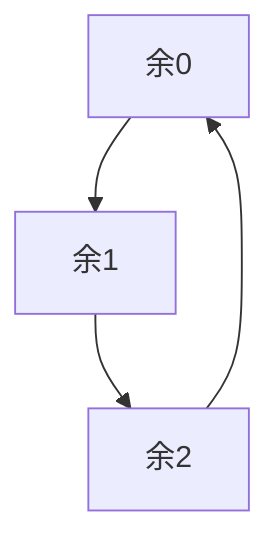

# 并查集

使用近乎 O(1) 的时间复杂度来完成两个操作：

+ 将两个集合合并，
+ 询问两个元素是否在一个集合当中。

基本原理：每个集合用一棵树来表示，树根的编号就是整个集合的编号。每个节点存储它的父节点，p[x]表示x的父节点。

可以通过找父亲的方式找到当前节点所在的集合。那么可以将根节点的父节点设为它自己，这样就可以通过这句代码来确定是否是根节点:

```java
if (p[x] == x)
```

对于一个集合中的所有节点都要找它所在集合的根节点的操作来说，有一个优化方式：路径压缩。


可以使用回溯同时完成路径压缩操作和找到集合编号（根节点编号）的操作：

```java
public int find(int x) {
    if (p[x] != x)	p[x] = find(p[x]);
    return p[x];
}
```

将两个集合合并：就是将一个集合的根节点的父节点修改为另一个集合的根节点即可。


代码就是：

```java
int px = find(x);
int py = find(y);
p[px] = py;
```

Java模板：

```java
int[] p = new int[N];  // 存父节点 -> 每个点的祖宗节点

// 初始化p，假定节点编号是1~n
for (int i = 1; i <= n; i ++ ) p[i] = i;

// 返回x的祖宗节点，集合的根节点
public int find(int x) {
    if (p[x] != x) p[x] = find(p[x]);
    return p[x];
}

// 合并a和b所在的两个集合：
p[find(a)] = find(b);
```

[\836. 合并集合](https://www.acwing.com/problem/content/838/)

> 一共有 n 个数，编号是 1∼n，最开始每个数各自在一个集合中。
>
> 现在要进行 m 个操作，操作共有两种：
>
> 1. `M a b`，将编号为 a 和 b 的两个数所在的集合合并，如果两个数已经在同一个集合中，则忽略这个操作；
> 2. `Q a b`，询问编号为 a 和 b 的两个数是否在同一个集合中；

```java
import java.util.*;

public class Main{
    static int N = 100010, n, m;
    static int[] p;  // 存父节点
    
    public static void main(String[] agrs) {
        Scanner sc = new Scanner(System.in);
        n = sc.nextInt();
        m = sc.nextInt();
        
        p = new int[n+1];
        for (int i = 1; i <= n; i++)
            p[i] = i;
        
        while (m-- != 0) {
            char op = sc.next().charAt(0);
            int a = Integer.parseInt(sc.next());
            int b = Integer.parseInt(sc.next());
            
            int pa = find(a), pb = find(b);
            
            if (op == 'M')  p[pa] = pb;
            else    System.out.println(pa == pb ? "Yes" : "No");
        }
    }
    
    public static int find(int x) {
        if (p[x] != x) p[x] = find(p[x]);
        return p[x];
    }
}
```

## 变形 1

在以上的基础，维护每个集合的元素个数。

[\837. 连通块中点的数量](https://www.acwing.com/problem/content/839/)

> 给定一个包含 n 个点（编号为 1∼n）的无向图，初始时图中没有边。
>
> 现在要进行 m 个操作，操作共有三种：
>
> 1. `C a b`，在点 a 和点 b 之间连一条边，a 和 b 可能相等；
> 2. `Q1 a b`，询问点 a 和点 b 是否在同一个连通块中，a 和 b 可能相等；
> 3. `Q2 a`，询问点 a 所在连通块中点的数量；

这题和上题相比只需要多开一个计数数组，记录每个集合中的节点个数，初始都为 1。

```java
import java.util.*;

public class Main{
    static int[] p, size;
    static int N = 100010;
    
    public static void main(String[] agrs) {
        Scanner sc = new Scanner(System.in);
        int n = sc.nextInt();
        int m = sc.nextInt();
        
        p = new int[n+1];
        size = new int[n+1];
        
        for (int i = 1; i <= n; i++)    {p[i] = i; size[i] = 1;}
        
        while (m-- != 0) {
            String op = sc.next();
            if ("C".equals(op)) {
                int a = sc.nextInt();
                int b = sc.nextInt();
                int pa = find(a), pb = find(b);
                if (pa != pb) {  // 如果是两个相同的集合就不用操作了
                    p[pa] = pb;
                    size[pb] += size[pa];
                }
            } else if ("Q1".equals(op)) {
                int a = sc.nextInt();
                int b = sc.nextInt();
                int pa = find(a), pb = find(b);
                System.out.println(pa == pb ? "Yes" : "No");
            } else {
                int a = sc.nextInt();
                System.out.println(size[find(a)]);
            }
        }
    }
    
    public static int find(int x) {
        if (p[x] != x)  p[x] = find(p[x]);
        return p[x];
    }
}
```

##  变形 2

维护每个节点到根节点的距离

[\240. 食物链](https://www.acwing.com/problem/content/242/)

> 动物王国中有三类动物 A,B,C这三类动物的食物链构成了有趣的环形。
>
> A 吃 B，B 吃 C，C 吃 A。
>
> 现有 N 个动物，以 1∼N 编号。
>
> 每个动物都是 A,B,C, 中的一种，但是我们并不知道它到底是哪一种。
>
> 有人用两种说法对这 N 个动物所构成的食物链关系进行描述：
>
> 第一种说法是 `1 X Y`，表示 X 和 Y 是同类。
>
> 第二种说法是 `2 X Y`，表示 X 吃 Y。
>
> 此人对 N 个动物，用上述两种说法，一句接一句地说出 K 句话，这 K 句话有的是真的，有的是假的。
>
> 当一句话满足下列三条之一时，这句话就是假话，否则就是真话。
>
> 1. 当前的话与前面的某些真的话冲突，就是假话；
> 2. 当前的话中 X 或 Y 比 N 大，就是假话；
> 3. 当前的话表示 X 吃 X，就是假话。
>
> 你的任务是根据给定的 N 和 K 句话，输出假话的总数。

用并查集来存储每个动物之间的关系，因为只有 3 种动物，所以可以设定用每个节点到跟节点的距离模 3 的值来表示节点之间的关系：

+ 余 1 ：可以吃根节点
+ 余 2 ：被根节点吃
+ 余 0 ：和根节点同类

他们的关系如图：余0 的被 余1 的吃，余1 的被 余2 的吃，余2 的被 余0 的吃



为了表示这个关系，我们还需要维护一个数组来保存每个节点到它父节点的距离。然后通过路径压缩，将每个节点的父节点都变成根节点。在路径压缩的时候，要将当前节点到父节点的距离更新成到根节点的距离，就需要将找到的根节点先用一个变量暂存，然后将原来父节点的距离加上，再更新父节点：

```java
public int find(int x) {
        if (p[x] != x) {
            int t = find(p[x]);
            d[x] += d[p[x]];
            p[x] = t;
        }
        return p[x];
    }
```

还有要注意一点：并查集是用来维护动物之间的关系的，当两个节点不在一个集合中的时候，说明此前没有维护过这对动物的关系，也就是说这是第一次出现，也就是说，这是一句真话。

那我们判断一个说法是真是假的时候，先判断 x 或 y 是否是大于 n 的，是则是假话，否则继续判断；再判断 x 和 y 的关系，是同类还是吃与被吃，就需要先判断它们是否在同一集合，在同一集合就分别判断，不在同一集合则说明这是一句真话，因为这是第一次出现，不会和前面已有的关系冲突。

当两个点不在同一个集合的时候，就需要将两个集合合并，这时就要考虑两个集合顶点间的距离如何计算了，如图：


```
当 x 和 y 是同类的时候：它俩到顶点的距离模 3 的值一定相等
	(d[x] + ?) % 3 == d[y] % 3
	? = d[y] - d[x]
当 x 和 y 是 x 吃 y 的时候：x 到顶点的距离模 3 的值一定比 y 的值大 1
	(d[x] + ?) % 3 == (d[y] + 1) % 3
	? = d[y] + 1 - d[x]
```

Java代码：

```java
import java.util.*;

public class Main{
    static int N = 100010;
    static int[] p = new int[N], d = new int[N];  // p 存父节点，d 存到父节点的距离
    
    public static void main(String[] args) {
        Scanner sc = new Scanner(System.in);
        int n = sc.nextInt();
        int m = sc.nextInt();
        
        for (int i = 1; i <= n; i++) p[i] = i;
        
        int t = 0, x = 0, y = 0, res = 0;
        while (m-- != 0) {
            t = sc.nextInt();
            x = sc.nextInt();
            y = sc.nextInt();
            
            if (x > n || y > n) res++;
            else {
                int px = find(x), py = find(y);
                if (t == 1) {  // 代表 x 和 y 是同类
                    if (px == py && (d[x] - d[y]) % 3 != 0) res++;  // 在同一个集合，但是不是同一类
                    else if (px != py) {  // 不在同一个集合，真话
                        p[px] = py;
                        d[px] = d[y] - d[x];
                    }
                } else {  // 表示 x 吃 y
                    if (px == py && (d[x] - d[y] - 1) % 3 != 0) res++;  // 在同一个集合，x 和 y 是同一类
                    else if (px != py) {  // 不在同一个集合，真话
                        p[px] = py;
                        d[px] = d[y] - d[x] + 1;
                    }
                }
            }
        }
        System.out.println(res);
    }
    public static int find(int x) {
        if (p[x] != x) {
            int t = find(p[x]);
            d[x] += d[p[x]];
            p[x] = t;
        }
        return p[x];
    }
}
```

