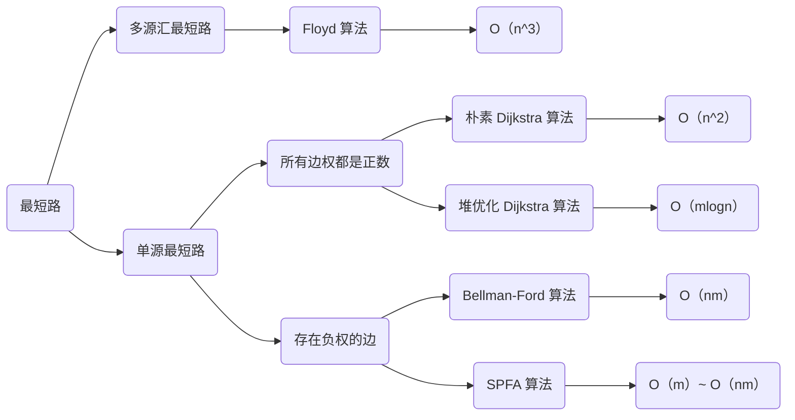

# 最短路

最短路一般分为两种情况：单源最短路和多源汇最短路，源是起点的意思，汇是终点的意思。

+ 单元最短路：求一个点到其他所有点的最短路
+ 多源汇最短路：起点和终点不确定，可能有多个

单源最短路又分为两种情况：

+ 所有边权都是正数
+ 存在负权边

每种情况对应的算法以及时间复杂度如下图，其中 n 表示图中点的个数，m 表示图中边的个数：




最短路最难的问题是建图，是如何将一个问题抽象出来。

图的存储：

+ 稠密图：邻接矩阵
+ 稀疏图：邻接表

这里介绍一下邻接矩阵的存储：

```java
// 创建邻接矩阵
int[][] g = new int[N][N];

// 初始化邻接矩阵
for (int i = 1; i <= n; i++)
    for (int j = 1; j<= n; j++)
        if (i == j)	g[i][j] = 0; 
        else g[i][j] = 0x3f3f3f;
```

邻接矩阵是用来存储两个点之间的边的，`g[i][j]` 表示点 i 到点 j 的边的权值，也表示两点之间是否有边。我们一般使用一个很大的值来表示没有边的情况。

## 朴素的 Dijkstra

实现步骤：

1. 初始化距离：第一个点的距离等于 0，其他所有点的距离都是无穷大
2. 循环：每次循环找出一个距离当前最近且没有被访问过的一个点
3. 利用这个点去更新其他点的距离，最后将这个点的访问状态置为已访问

使用邻接矩阵 `g[][]` 存储点和边，需要一个数组 `d[]` 存储每个点离源点的最短距离，还要记录每个点的访问状态 `f[]`。

如何找到当前最近的且没有被访问过的点？

```java
int t = -1;
for (int j = 1; j <= n; j++)  // 遍历每个点
	if (!f[j] && (t == -1 || d[t] > d[j]))  // 没被访问过，且距离源点的距离d[j]最小
        t = j;
```

t 就是当前最近且没有被访问过的点。

如何利用这个点去更新其他点的距离？

```java
for (int j = 1; j <= n; j++)
    d[j] = Math.min(d[j], d[t] + g[t][j]);
f[t] = true;
```

用当前距离源点的位置 `d[j]` 与从点 t 到点 j 的距离 `g[t][j]` 加 `d[t]` 的和进行比较，取最小值。


模板：

```java
int[][] g = new int[N][N];  // 存储每条边
int[][] d = new int[N][N];;  // 存储1号点到每个点的最短距离
boolean f[] = new boolean[N];   // 存储每个点的最短路是否已经确定

// 求1号点到n号点的最短路，如果不存在则返回-1
public int dijkstra() {
    Arrays.fill(d, 0x3f3f3f3f);
    d[1] = 0;

    for (int i = 0; i < n - 1; i ++ )
    {
        int t = -1;     // 在还未确定最短路的点中，寻找距离最小的点
        for (int j = 1; j <= n; j ++ )
            if (!f[j] && (t == -1 || d[t] > d[j]))
                t = j;

        // 用t更新其他点的距离
        for (int j = 1; j <= n; j ++ )
            d[j] = Math.min(d[j], d[t] + g[t][j]);

        f[t] = true;
    }

    if (d[n] == 0x3f3f3f3f) return -1;
    return d[n];
}
```


[Dijkstra求最短路 I](https://www.acwing.com/problem/content/description/851/)

> 给定一个 n 个点 m 条边的有向图，图中可能存在重边和自环，所有边权均为正值。
>
> 请你求出 1 号点到 n 号点的最短距离，如果无法从 1 号点走到 n 号点，则输出 −1。

题目中的自环不需要考虑，因为初始化时，`if(i == j) g[i][j] = 0;` 这一句就处理自环问题。

需要注意的是重边，如果有重边的话，就取最小值，所以每次赋值的时候需要判断以下，取最小值。

```java
import java.util.*;

public class Main{
    static int N = 510, n, m;
    static int[][] g = new int[N][N];  // 邻接矩阵
    static int[] d = new int[N];  // 存点到源点的距离
    static boolean[] f = new boolean[N];  // 记录访问状态
    
    public static void main(String[] args) {
        Scanner sc = new Scanner(System.in);
        n = sc.nextInt();
        m = sc.nextInt();
        
        for (int i = 1; i <= n; i++)
            for (int j = 1; j <= n; j++)
                if (i == j) g[i][j] = 0;  // 处理自环
                else    g[i][j] = 0x3f3f3f;  // 初始化为一个很大的值
        
        while (m-- != 0) {
            int x = sc.nextInt();
            int y = sc.nextInt();
            int z = sc.nextInt();
            
            g[x][y] = Math.min(g[x][y], z);  // 取最小值，防止重边
        }
        
        System.out.println(dijkstra());
    }
    
    public static int dijkstra() {
        Arrays.fill(d, 0x3f3f3f);  // 给距离初始化
        d[1] = 0;  // 源点的距离为0
        
        for (int i = 0; i < n; i++) {
            // 找出当前最近且未被访问过的点
            int t = -1;
            for (int j = 1; j <= n; j++)
                if (!f[j] && (t == -1 || d[t] > d[j]))
                    t = j;
            
            // 改变访问状态
            f[t] = true;
            
            // 用这个点取更新其他点
            for (int j = 1; j <= n; j++)
                d[j] = Math.min(d[j], d[t] + g[t][j]);
        }
        // 返回最短距离
        if (d[n] == 0x3f3f3f)  return -1;
        else    return d[n];
    }
}
```

## 堆优化的Dijkstra

在朴素的 Dijkstra 中，每次找出当前最近且未被访问过的点时，都会进行 n 次循环，我们可以使用堆来优化这部分操作，让其时间降为O(1)。，其他操作都没有什么变化。

模板：

```java
// 邻接表存储所有边，w存储边的权重
int[] h = new int[N], w = new int[N];
int[] val = new int[N], nex = new int[N];  

boolean[] f = new boolean[N];  // 存储每个点的最短距离是否已确定
int[] d = new int[N];  // 存储所有点到1号点的距离
Queue<Node> q = new PriorityQueue<>();  // 优先队列

// 求1号点到n号点的最短距离，如果不存在，则返回-1
public int dijkstra() {
    Arrays.fill(d, 0x3f3f3f3f);
    d[1] = 0;

    q.add(new Node(1, 0));

    while (!q.isEmpty()) {
        Node t = q.poll();

        if (f[t.num])   continue;

        for (int i = h[t.num]; i != 0; i = nex[i]) {
            int j = val[i];
            if (d[j] > t.dist + w[i]) {
                d[j] = t.dist + w[i];
                q.add(new Node(j, d[j]));
            }
        }
            f[t.num] = true;
    }
    return d[n] == 0x3f3f3f3f ? -1 : d[n];
}
```

[Dijkstra求最短路 II](https://www.acwing.com/problem/content/852/)

> 给定一个 n 个点 m 条边的有向图，图中可能存在重边和自环，所有边权均为非负值。
>
> 请你求出 11 号点到 n 号点的最短距离，如果无法从 1 号点走到 n 号点，则输出 −1。

因为是稠密图，所以使用邻接表的方式存储。同时使用优先队列的话，队列里面的元素一定要是可排序的。

```java
import java.util.*;
class Node implements Comparable{
	int num;  // 点的编号
	int dist;  // 离源点的距离
	public Node(int num, int dist) {
		this.num = num;  
		this.dist = dist;
	}

	@Override
	public int compareTo(Object o) {
		Node t = (Node)o;
		return this.dist - t.dist;
	}
}
public class Main{
	static int N = 200010, idx = 1, n, m;
    // 邻接表
	static int[] h = new int[N];
	static int[] val = new int[N], nex = new int[N];
    // 状态记录数组
	static boolean[] f = new boolean[N];
    // 离源点的距离数组，记录边的权值的数组
	static int[] d = new int[N], w = new int[N];
    // 优先队列
	static Queue<Node> q = new PriorityQueue<>();

	public static void main(String[] args) {
		Scanner sc = new Scanner(System.in);
		n = sc.nextInt();
		m = sc.nextInt();

		while (m-- != 0) {
			int x = sc.nextInt();
			int y = sc.nextInt();
			int z = sc.nextInt();

			add(x, y, z);
		}

		System.out.println(dijsktra());
	}

	public static int dijsktra() {
        // 先给所有距离初始化很大，除了源点
		Arrays.fill(d, 0x3f3f3f3f);
		d[1] = 0;

        // 将源点加入队列
		q.add(new Node(1, 0));

		while (!q.isEmpty()) {
			Node t = q.poll();

			if (f[t.num])   continue;

            // 用当前点取更新其他点
			for (int i = h[t.num]; i != 0; i = nex[i]) {
				int j = val[i];
				if (d[j] > t.dist + w[i]) {
					d[j] = t.dist + w[i];
					q.add(new Node(j, d[j]));
				}
			}

			f[t.num] = true;
		}
		
		return d[n] == 0x3f3f3f3f ? -1 : d[n];
	}

	public static void add(int a, int b, int c) {
		val[idx] = b;
		nex[idx] = h[a];
		w[idx] = c;
		h[a] = idx++;
	}
}
```

## Bellman-Ford

时间复杂度 $O(nm)$ ，n 表示点数，m 表示边数。

该算法的核心就是遍历到所有边，更新最短距离。

模板：

```java
// 存储每条边的结构
class Edge {
    int a, b, w;
    public Edge(int a, int b, int w) {
        this.a = a;  // 起点
        this.b = b;  // 终点
        this.w = w;  // 权值
    }
}
// n表示点数，m表示边数
int n, m;
// d存每个点离源点的最短距离
int[] d = new int[N];
// edges存每条边的信息：起点、终点、权值
Edge[]  edges = new Edge[M];

// Bellman-Ford，求1到n的最短路距离，如果无法从1走到n，则返回-1。
public static boolean bellman_ford() {
    Arrays.fill(d, 0x3f3f3f3f);
    d[1] = 0;

    // 如果第n次迭代仍然会松弛三角不等式，就说明存在一条长度是n+1的最短路径，由抽屉原理，路径中至少存在两个相同的点，说明图中存在负权回路。
    for (int i = 0; i < n; i++) {
        // 遍历每一条边
        for (int j = 0; j < m; j++) {
            int a = edges[j].a;
            int b = edges[j].b;
            int w = edges[j].w;
            d[b] = Math.min(d[b], backup[a] + w);  // 松弛操作
        }
    }

    if (d[n] > 0x3f3f3f3f / 2)  return -1;
    return d[n];
}
```

第一层循环的意义：求出从 1 号点，经过不超过 n 条边到达的每个点的最短距离。

第二层循环的意义：遍历每一条边，更新每条边的终点离源点的最短距离。

这个算法最后，会得到一个三角不等式：$d[b]\le d[a]+w$。

在这个算法中可以使用任意的数据结构来存储图，因为只要是能遍历到所有的边即可。

[有边数限制的最短路](https://www.acwing.com/problem/content/855/)

> 给定一个 n 个点 m 条边的有向图，图中可能存在重边和自环， **边权可能为负数**。
>
> 请你求出从 1 号点到 n 号点的最多经过 k 条边的最短距离，如果无法从 1 号点走到 n 号点，输出 `impossible`。

这道题限制了最多经过 k 条边的距离，所以第一层循环最多是 k 次。需要注意的是，因为每一次遍历所有边的时候，都可能修改距离数组，这样的话可能会导致串联现象的发生，比如：


假如要求最多经过 1 条边的最短距离，那么答案应该是 3。而如果发生串联现象，那么最终得到的答案就是 2。首先 d[2] 是正无穷大，它会被 1 号点更新为 1，然后当遍历到 2 -> 3 这条边时，d[3] 本来是无穷大，就会被更新为 d[2] + w[3] 也就是 1+1=2，这就是串联现象的发生。

这种情况呢就是因为 d[2] 的值进行了改变，所以为了避免这种情况发生，在遍历所有边之前，先将此时的 d 数组备份一份，用这个备份的数组去进行操作即可。

```java
import java.util.*;
class Edge {
    int a, b, w;
    public Edge(int a, int b, int w) {
        this.a = a;
        this.b = b;
        this.w = w;
    }
}
public class Main{
    static int N = 510, M = 10010, n, m, k;
    // d存每个点离源点的最短距离
    static int[] d = new int[N];
    // edges存每条边的信息：起点、终点、权值
    static Edge[]  edges = new Edge[M];
    
    public static void main(String[] args) {
        Scanner sc = new Scanner(System.in);
        n = sc.nextInt();
        m = sc.nextInt();
        k = sc.nextInt();
        
        for (int i = 0; i < m; i++) {
            int x = sc.nextInt();
            int y = sc.nextInt();
            int z = sc.nextInt();
            edges[i] = new Edge(x, y, z);
        }
        
        if (bellman_ford()) System.out.println(d[n]);
        else System.out.println("impossible");
    }
    
    public static boolean bellman_ford() {
        Arrays.fill(d, 0x3f3f3f3f);
        d[1] = 0;
        
        // 要求最多经过k条边，所以最多遍历k次，每一次都会更新最短距离
        for (int i = 0; i < k; i++) {
            // 先将距离数组备份一份，因为下面操作会修改d
            int[] backup = Arrays.copyOf(d, N);
            // 遍历每一条边
            for (int j = 0; j < m; j++) {
                int a = edges[j].a;
                int b = edges[j].b;
                int w = edges[j].w;
                d[b] = Math.min(d[b], backup[a] + w);
            }
        }
        
        // 因为存在负权边，所以d[n]最小可能是正无穷减去500个10000
        if (d[n] > 0x3f3f3f3f - (int)5e6)  return false;
        return true;
    }
}
```


## SPFA

SPFA 算法是对 Bellman-Ford 算法的优化。

时间复杂度（n表示点数，m表示边数）：

+ 平均情况下：$O(m)$
+ 最坏情况下：$O(nm)$ 

在 Bellman-Ford 中，会对所有的边都进行遍历，但是不一定所有的边的距离都会发生改变，所以其实有很多次遍历是浪费的。而对于一条边 a --> b 来说，只有 d[a] 变小了，d[b] 才可能变小，因为 d[b] = d[a] + w，所以 SPFA 利用这个性质，使用队列，每次将变小过的边加入队列，最后只需要遍历队列中的边即可达成优化的效果。

模板：

```java
// n表示点数，m表示边数，idx为链表的指针
int n, m, idx = 1;
// 邻接表存储，d表示距源点距离，w表示边的权值，w[i]表示第i条插入的边的权值
int[] h = new int[N], d = new int[N], w = new int[N];
int[] val = new int[N], nex = new int[N];
// 状态数组记录点有没有被加入队列
static boolean[] f = new boolean[N];

// SPFA，求1号点到n号点的最短路距离，如果从1号点无法走到n号点则返回-1
public static int spfa() {
    Arrays.fill(d, 0x3f3f3f3f);
    d[1] = 0;

    Queue<Integer> q = new LinkedList<>();
    q.add(1);
    f[1] = true;

    while (!q.isEmpty()) {
        int t = q.remove();
        f[t] = false;

        for (int i = h[t]; i != 0; i = nex[i]) {  // 遍历t的所有出边
            int j = val[i];
            // 只有当前边的距离变小了，后边的边的距离才可能变小，所以将当前点加入队列
            if (d[j] > d[t] + w[i]) {
                d[j] = d[t] + w[i];
                if (!f[j]) {    // 如果队列中已存在j，则不需要将j重复插入
                    q.add(j);
                    f[j] = true;
                }
            }
        }
    }
    if (d[n] == 0x3f3f3f3f) return -1;
    return d[n];
}
```

[spfa求最短路](https://www.acwing.com/problem/content/853/)

> 给定一个 n 个点 m 条边的有向图，图中可能存在重边和自环， **边权可能为负数**。
>
> 请你求出 1 号点到 n 号点的最短距离，如果无法从 1 号点走到 n 号点，则输出 `impossible`。
>
> 数据保证不存在负权回路。

```java
import java.util.*;

public class Main{
    static int N = 100010, n, m, idx = 1;
    // 邻接表存储，d表示距源点距离，w表示边的权值，w[i]表示第i条插入的边的权值
    static int[] h = new int[N], d = new int[N], w = new int[N];
    static int[] val = new int[N], nex = new int[N];
    // 状态数组记录点有没有被加入队列
    static boolean[] f = new boolean[N];
    
    public static void main(String[] args) {
        Scanner sc = new Scanner(System.in);
        n = sc.nextInt();
        m = sc.nextInt();
        
        while (m-- != 0) {
            int a = sc.nextInt();
            int b = sc.nextInt();
            int c = sc.nextInt();
            add(a, b, c);
        }
        
        if (spfa() != 0x3f3f3f3f) System.out.println(d[n]);
        else    System.out.println("impossible");
    }
    
    public static void add(int a, int b, int c) {
        val[idx] = b;
        nex[idx] = h[a];
        w[idx] = c;
        h[a] = idx++;
    }
    
    public static int spfa() {
        Arrays.fill(d, 0x3f3f3f3f);
        d[1] = 0;
        
        Queue<Integer> q = new LinkedList<>();
        q.add(1);
        f[1] = true;
        
        while (!q.isEmpty()) {
            int t = q.remove();
            f[t] = false;
            
            for (int i = h[t]; i != 0; i = nex[i]) {
                int j = val[i];
                // 只有当前边的距离变小了，后边的边的距离才可能变小，所以将当前点加入队列
                if (d[j] > d[t] + w[i]) {
                    d[j] = d[t] + w[i];
                    if (!f[j]) {
                        q.add(j);
                        f[j] = true;
                    }
                }
            }
        }
        return d[n];
    }
}
```

## SPFA判断负环

SPFA 算法除了求最短路外，还可以判断图中是否存在负环。

时间复杂度：$O(nm)$ ，n表示点数，m表示边数。

只需要另使用一个计数数组 cnt，来记录当前点的最短路经过了多少条边即可。

模板：

```java
// n表示点数，m表示边数，dix为链表指针
int n, m, idx = 1;
// d[x]存储1号点到x的最短距离，cnt[x]存储1到x的最短路中经过的点数
int[] d = new int[N], cnt = new int[N];
// 邻接表存储所有边，w存权重
static int[] h = new int[M], val = new int[M], nex = new int[M], w = new int[M];
// 存储每个点是否在队列中
static boolean[] f = new boolean[N];

// SPFA，如果存在负环，则返回true，否则返回false。
public static boolean spfa() {
    Queue<Integer> q = new LinkedList<>();
    for (int i = 1; i <= n; i++) {
        q.add(i);
        f[i] = true;
    }

    while (!q.isEmpty()) {
        int t = q.remove();
        f[t] = false;

        for (int i = h[t]; i != 0; i = nex[i]) {
            int j = val[i];
            if (d[j] > d[t] + w[i]) {
                d[j] = d[t] + w[i];
                cnt[j] = cnt[t] + 1;
                if (cnt[j] >= n)    return true;
                if (!f[j]) {
                    q.add(j);
                    f[j] = true;
                }
            }
        }
    }
    return false;
}
```

SPFA 算法不需要初始化 d 数组，因为如果存在负环的话，d[j] 一定大于 d[t] + w[i]。

SPFA 原理：如果某条最短路径上有n个点（除了自己），那么加上自己之后一共有n+1个点，由抽屉原理一定有两个点相同，所以存在环。

在无环的情况下，n 条边就表示着 n+1 个点，当 cnt 的计数达到 n+1 时，说明起码有一个点被计算了两次，就说明有环存在；且因为只会更新最小值，说明这个环的距离会变小，说明是负环。

[spfa判断负环](https://www.acwing.com/problem/content/854/)

> 给定一个 n 个点 m 条边的有向图，图中可能存在重边和自环， **边权可能为负数**。
>
> 请你判断图中是否存在负权回路。

要使用队列，需要将所有的点都放入队列中，因为负环不一定能从 1 号点到达，所以遍历所有点可以保证一定找到负环。

```java
import java.util.*;

public class Main{
    static int N = 2010, M = 10010, n, m, idx = 1;
    static int[] d = new int[N], cnt = new int[N], w = new int[M];
    static int[] h = new int[M], val = new int[M], nex = new int[M];
    static boolean[] f = new boolean[N];
    
    public static void main(String[] args) {
        Scanner sc = new Scanner(System.in);
        n = sc.nextInt();
        m = sc.nextInt();
        
        while (m-- != 0) {
            int a = sc.nextInt();
            int b = sc.nextInt();
            int c = sc.nextInt();
            add(a, b, c);
        }
        
        System.out.println(spfa() ? "Yes" : "No");
    }
    
    public static void add(int a, int b, int c) {
        val[idx] = b;
        w[idx] = c;
        nex[idx] = h[a];
        h[a] = idx++;
    }
    
    public static boolean spfa() {
        Queue<Integer> q = new LinkedList<>();
        for (int i = 1; i <= n; i++) {
            q.add(i);
            f[i] = true;
        }
            
        while (!q.isEmpty()) {
            int t = q.remove();
            f[t] = false;
            
            for (int i = h[t]; i != 0; i = nex[i]) {
                int j = val[i];
                if (d[j] > d[t] + w[i]) {
                    d[j] = d[t] + w[i];
                    cnt[j] = cnt[t] + 1;
                    if (cnt[j] >= n)    return true;
                    if (!f[j]) {
                        q.add(j);
                        f[j] = true;
                    }
                }
            }
        }
        return false;
    }
}
```

